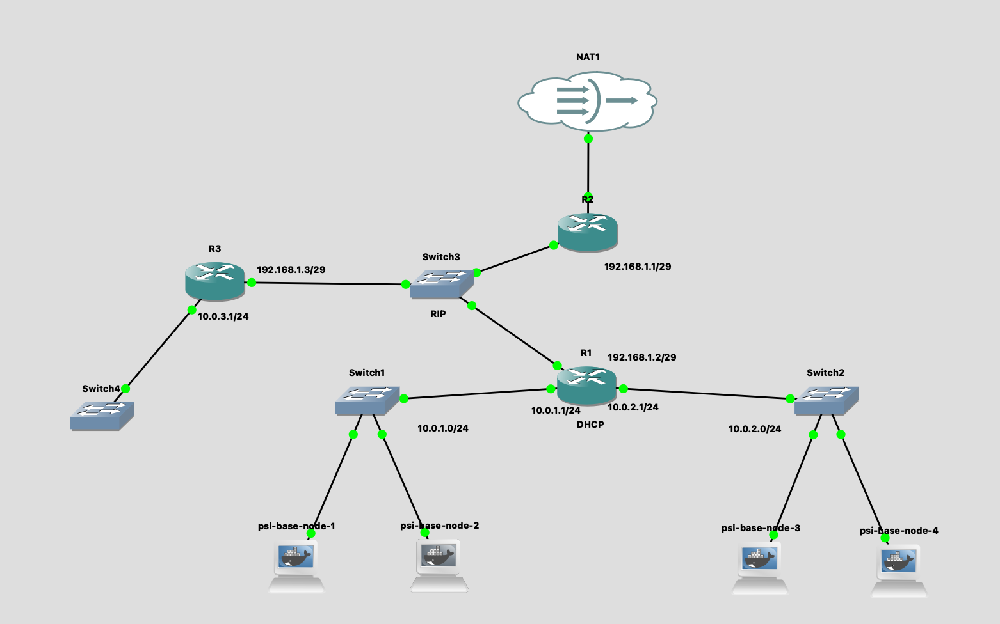
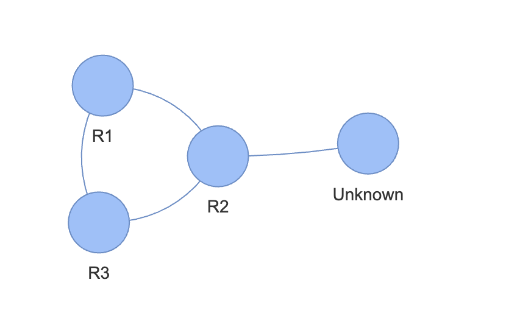

# Network Topology Mapper

This project is a Python application that automatically discovers the network topology of a given network using the SNMP protocol. The application retrieves routing table information from routers, identifies additional routers, and visualizes the network topology in an interactive HTML file.

## Features
- **DHCP Discovery**: Automatically identifies the DHCP server by sending DHCP discovery packet.
- **SNMP-based Topology Mapping**: Uses SNMP to query routing tables, system names, and IP addresses from routers using BFS algorithm.
- **Interactive Visualization**: Outputs the discovered topology as an interactive HTML file using the PyVis library.

## File Overview
### 1. `main.py`
The main entry point of the application. It orchestrates the DHCP discovery, SNMP topology mapping, and visualization processes.

### 2. `dhcp_discovery.py`
Handles the discovery of the DHCP server to identify the starting point (default gateway) for SNMP queries. 
- Sends a DHCP Discover packet.
- Listens for a DHCP Offer response to extract the server's IP address.

### 3. `snmp_topology_mapper.py`
Implements the core logic for discovering the network topology:
- Retrieves system names (`sysName`), IP addresses (`ipAdEntAddr`), and routing neighbors (`ipRouteNextHop`) via SNMP.
- Iteratively explores the network by querying discovered neighbors using BFS algorithm.

### 4. `topology_node.py`
Defines the `TopologyNode` class, which represents a network node with:
- A unique identifier.
- A list of associated IP addresses.
- A list of neighboring nodes.

### 5. `topology_visualizer.py`
Visualizes the discovered topology as an interactive HTML file using the PyVis library.

## Setup and Usage
### Prerequisites
- Python 3.x
- Required Python libraries: `scapy`, `pysnmp`, and `pyvis`.

### Installation
1. Clone this repository:
   ```bash
   git clone https://github.com/jakubkrizanovsky/NetworkTopologyMapper.git
   cd NetworkTopologyMapper
   ```

2. Install the required dependencies:
    ```bash
    pip install -r requirements.txt
    ```

### Running the Application
1. Launch the application:
    ```bash
    python3 main.py
    ```

2. The application performs the following steps:
- Discovers the DHCP server.
- Maps the network topology recursively using SNMP.
- Outputs an interactive HTML file (e.g., topology.html) with the network visualization.

3. Open the generated HTML file in a web browser to explore the topology.

## Sample input and output
For the following network in network virtualization software `gns3` the output visualized topology is the following:

### Input network:


### Output network topology visualization:
